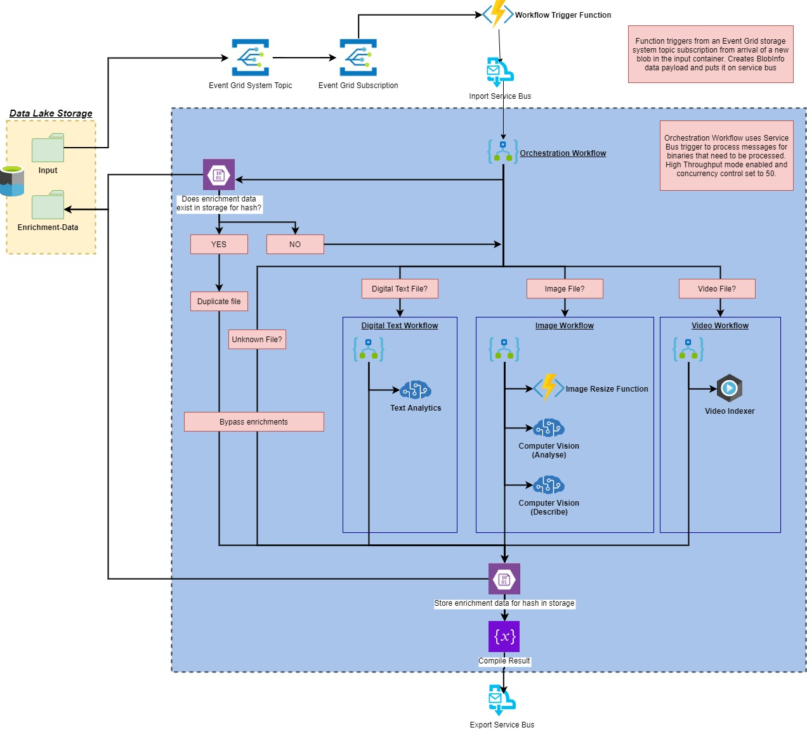

# AI Enrichment Pipeline

This repository contains an AI enrichment pipline which triggers from the upload of binary file to an Azure Storage account. The pipeline will "enrich" the file with additional insights from various Azure Cognitive Services, custom ode and Video Indexer before submitting it to a Service Bus queue for further processing.

This solution determines which cognitive service to use based on the classification of the file into one of three file categories:

- **Digital Text File** - The Digital Text workflow uses [Text Analytics API](https://docs.microsoft.com/en-us/azure/cognitive-services/Text-Analytics/) to obtain key phrases, PII information and entities from plain text files (complex text file such as Office documents are not supported)
- **Images** - The Image workflow uses the [Computer Vision API](https://azure.microsoft.com/en-us/services/cognitive-services/computer-vision/) to analyse for visual features, objects and brands and describe the image.
- **Videos** - The Video workflow uses [Video Indexer](https://api-portal.videoindexer.ai/) to process and extract key information such as Face Detection, OCR, Content Moderation, identification of visual objects, transcription and translation of audio and many more features.

The solution is comprised of the following technologies

- **Azure DataLake** for blob storage
- **Azure Event Grid** for event triggering
- **Azure Functions** for workflow triggering and image resizing
- **Azure Logic Apps** for orchestration
- **Azure Cognitive Services** (Text Analytics, Computer Vision)
- **Azure Video Indexer** for video analysis
- **Azure Service Bus** for queueing and internal messaging. The output of the pipline uses service bus which can easily be integrated into down-stream services.

The solution minimises the cost of enrichment by identifying duplicate files (by hash; i.e. files with the same binary contents but a different file name) and retrieving previously stored enrichment data for those files.

The solution creates and passes around a data object which contains usefull information for accessing and processing the file in storage, this is called `BlobInfo`. This is created by the WorkflowTrigger function and is the trigger payload for each of the Logic Apps.

Each top level folder should contain a `readme.md` documenting their components, expected usage and further guidance.

- [.devcontainer](./.devcontainer): Configuration for the development environment. [Quick start docs here](https://code.visualstudio.com/docs/remote/containers-tutorial)
- [.vscode](./.vscode): Contains shared settings files for Visual Studio Code
- [infra](./infra): Infrastructure as Code (Terraform) to build the environment
- [functions](./functions): All custom Azure Functions and .net code
- [logicapp](./logicapp): Workflows templates (ARM) deployed to Azure Logic Apps
- [scripts](./scripts): Infrastructure and integration test scripts and testing tools

This is the high level system architecture.

## Quick Start

The repository uses [`psmake`](https://github.com/psake/psake) to automate tasks for builds and developer utility. It uses [devcontainers and VSCode](https://code.visualstudio.com/docs/remote/containers-tutorial) to manage the development environment and tooling.

To get started follow the documentation at [/infra/readme.md](infra/readme.md).

## Using the solution

The pipeline can be initiated by simply uploading a file to the `input` blob container in the core storage account in the deployed azure resource group. The exact name of the storage account will vary but will something like `corestorxxxxx` (where the 5 x's are random characters generated by Terraform).

The simplest way to upload files is using [Azure Storage Explorer](https://azure.microsoft.com/en-gb/features/storage-explorer/).

If you want to test the operation with a large batch of files, you can synthetically generate files using the [test file generator tool](./scripts/testfile_generator).

### Force re-enrichment of previously enriched files

There may be a need to force re-enrichment of previously enriched files. If you simply re-upload the files, it will be classified as a duplicate and the stored enrichment from the previous run will be used.

There are two ways to force a fresh enrichment.

1. Delete the corresponding enrichment data file from the `enrichment-data` blob container in the core storage account. You will have to find the hash of the file in order to identify the right enrichment data file as files are named after the hash of the blob that created the enrichments.
2. The Orchestration Logic App has a Boolean parameter called `DetectDuplciates` which defaults to `true`. When true, duplicate files will be detected; however this can be manually changed to `false` which means that the duplicate detection part of the solution is bypassed and all files are enriched as if they were new files. If there is existing enrichment data, it gets overwritten at the end. Please be aware that when set, this parameter applies to all files that are processed.

### Running costs

This repository will deploy to the North Europe Azure datacentre by default and will have an estimated daily running cost of $2-$3 without a load being run through it. 
> The default location can be changed by editing the `resource_group_location` variable in `/infra/variable.tf`.

The majority of the cost is accumulated due to the functions which are deployed on production size [EP1](https://docs.microsoft.com/en-us/azure/azure-functions/functions-premium-plan?tabs=portal) (Elastic Premium 1).

In order to reduce costs, all functions have been deployed on the same App Service Plan. 
To find out more information about the cost of the resource group in the Azure portal by looking at the Cost Analysis tab in side the main resource group you deploy to.

It is important to point out that whilst most of the cost is via Functions and Cognitive Services, costs for storage can accumulate quickly if files are large in size and there are many of them.