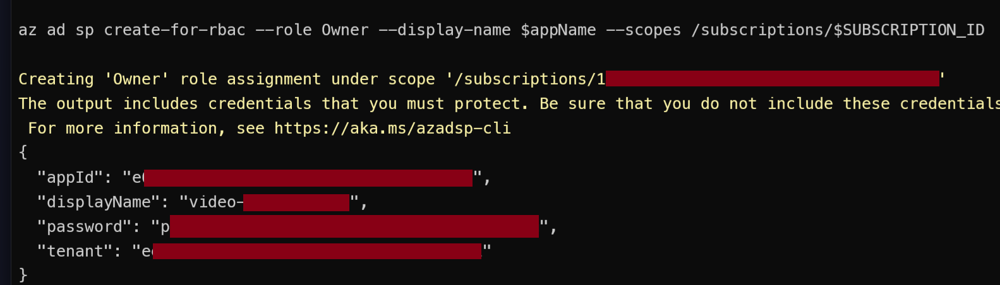

# Official Applied AI services| Video Indexer API page

<!--
Guidelines on README format: https://review.docs.microsoft.com/help/onboard/admin/samples/concepts/readme-template?branch=master

Guidance on onboarding samples to docs.microsoft.com/samples: https://review.docs.microsoft.com/help/onboard/admin/samples/process/onboarding?branch=master

Taxonomies for products and languages: https://review.docs.microsoft.com/new-hope/information-architecture/metadata/taxonomies?branch=master
-->

This folder contains the basic ways to address Video Indexer's API in order to allow full engagment with the product: Get Account, Get Access token through ARM API, upload a video, polling on status/waiting, and indexing the video.
It is highly recommend to first read the more detailed documentation which can be found [here](https://aka.ms/avam-arm-docs).

For more API abilities, please visit our [API documentation](https://api-portal.videoindexer.ai/)

## Contents

The sample code demonstrates important aspect of uploading and indexing a video for ARM-based accounts, availble from December 2021.
Following the code will give you a good idea of how to use our API for basic functionalities.
Make sure to read the inline comments and notice our best practices advices.

## Prerequisites

Instructions:

1. Go to Program.cs and populate the following variables:
  - `SubscriptionId` with your subscription id
  - `ResourceGroup` with your resource group
  - `ViAccountName` with your account name
  - `VideoUrl` with your video url, in case you want to use the video from publicly accessed URL, or `LocalVideoPath` with local path to video file.
  - `ExcludedAI` with the AI's you want to exclude from the indexing job.

2. Review the VideoIndexerClient/VideoIndexerClient.cs file to learn about the implementation of the API. 
<br>
The Client is a convineint Http Wrapper around REST calls, and can be replaced easily with your custom behavior.  Note the section of issuing Video Indexer Access Token.
(The Token is Valid for 30 minutes) .
</br>

3. make sure dotnet 6.0 is installed. if not, please install https://dotnet.microsoft.com/download/dotnet/6.0
4. Open your terminal and navigate to "ApiUsage\ArmBased" folder
5. Run dotnet build

For more information visit [here](https://docs.microsoft.com/en-us/azure/media-services/video-indexer/video-indexer-use-apis)

<!--
Outline the required components and tools that a user might need to have on their machine in order to run the sample. This can be anything from frameworks, SDKs, OS versions or IDE releases.
-->

## Authentication Model

This sample demonstrates two methods for authenticating the code to the Video Indexer account.

1. Using Default Azure Credentials: This method utilizes the logged-in user or a User Assigned Managed Identity/System Assigned Identity associated with the running host.
2. Using Service Principal Authentication (Entra App Registration)

### Authentication with User,Group or Managed Identity

1. Ensure that you are logged in to your Azure subscription by running the `az login` command.

2. If you are using the same user across multiple tenants, set the `tenantId` variable under the `AccountTokenProvider.cs` class.

3. Extract the Object Id of the logged-in user or Managed Identity and proceed to [Grant Role Assignment](#grant-role-assignment) section below.


### Authentication with Entra App for RBAC flow 

1. Create an Azure Entra ID App that will be used as a service principal.

```
az ad sp create-for-rbac --role Owner --display-name $appName --scopes /subscriptions/$SUBSCRIPTION_ID
```

2. After the command finishes, write down the values for appId (clientId) and password that will be used in your code.




3. Run the following command to extract the servicePrincipalId to be used it on [Grant Role Assignment](#grant-role-assignment) section below.

```
servicePrincipalId=$(az ad sp list --display-name $appName --query "[0].id" -o tsv)
```
4. Open the `AccountTokenProvider.cs` and fill in the following variables, from the values received on step 2

- TenantId 
- ClientId
- ClientSecret

```
 public static class AccountTokenProvider
 {
     private static readonly string TenantId = Environment.GetEnvironmentVariable("TENANT_ID");
     private static readonly string ClientId = Environment.GetEnvironmentVariable("CLIENT_ID");
     private static readonly string ClientSecret = Environment.GetEnvironmentVariable("CLIENT_SECRET");

  ...
 }
```
> **Note**: The term "ClientId" is another name for AAD Application Id. It refers to the same value that was received during the creation phase and is also known as "appId".

<h3 id="grant-role-assignment">Grant Role Assignment</h3>

In both cases, the logged-in service principal (user, Managed Identity, or Entra App) must have the `Contributor` role assigned to the Video Indexer account. Replace the `SUBSCRIPTION_ID`, `RESOURCE_GROUP`, `VIDEO_INDEXER_ACCOUNT_NAME`, and `servicePrincipalId` with your values, and run the following command:

```
videoIndexerId="/subscriptions/SUBSCRIPTION_ID/resourceGroups/RESOURCE_GROUP/providers/Microsoft.VideoIndexer/accounts/VIDEO_INDEXER_ACCOUNT_NAME"
az role assignment create --assignee $servicePrincipalId --role "Contributor" --scope $videoIndexerId
```


## Usage

Run dotnet run

# Additional Reading
- [Authenticate with Azure CLI](https://learn.microsoft.com/en-us/cli/azure/authenticate-azure-cli)
- [Create Entra Id App for Rbac Permission](https://learn.microsoft.com/en-us/entra/identity-platform/howto-create-service-principal-portal)


