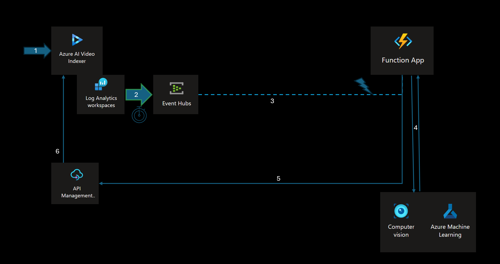

# Bring-Your-Own Model with Video Indexer API and Complete Custom Model Flow

## Table of Contents
- [Overview](#overview)
- [Prerequisites](#prerequisites)
- [Deployment](#deployment)
- [Usage](#usage)
- [Contributing](#contributing)
- [License](#license)

## Overview
In this tutorial you will learn how to integrate Video Indexer "BYO" (Bring-Your-Own) custom Model capabilities with external AI Platform (Azure AI Computer Vision)
The tutorial assumes you already own a custom model that was trainined on Azure AI Computer vision and the tutorial will only focus on the integration between the model and the Video Indexer API.

For more information visit [Compute Vision Customization](https://learn.microsoft.com/en-us/azure/ai-services/computer-vision/how-to/model-customization?tabs=studio)


### What we are building 



In this tutorial we will build the entire Video Indexer components and the backend system using Azure CLI / bicep templates . we will assume the Custom Model is already hosted on Azure AI Computer Vision.

The Flow of using a custom model for Video Indexer has the following steps :

1. You Create a Video Indexer Instance that has Diagnostics setting integration.
2. The diagnostic setting is configured to send Video Indexer log and audit events to Event Hubs namespace.
3. A backend serverless process built on top of Azure Function, detects an an indexing completion event from the event-hub, and start consuming the video indexer insights ( detect objects frame in our case).
4. The backend process calls the custom model with several frames/media assets, and aggregates the results.
5. The aggregated results are sent back to the Video Indexer API instance to update ("patch") the current insights with those received by the custom model.
5. The results are reflected on the Video Indexer portal and on the assets and insights results for that media asset.

The entire flow will be built using Azure CLI /bicep with no manual steps required.


## Prerequisites
Before deploying the Bicep items, please ensure that you have the following prerequisites installed:

- Azure subscription with permissions to create Azure resources
- The latest version of [Azure CLI](https://learn.microsoft.com/cli/azure/install-azure-cli). the latest version already contains the Bicep CLI.
- Dot Net Core 6.0 SDK [.Net Core SDK](https://dotnet.microsoft.com/en-us/download/dotnet/6.0)
- *Recommended*: [Bicep Tools](https://learn.microsoft.com/en-us/azure/azure-resource-manager/bicep/install)


## Deployment
To deploy the Bicep items, follow these steps:

1. Clone the repository:

```shell
git clone https://github.com/Azure-Samples/media-services-video-indexer.git
```

2. Navigate to this tutorial deployment directory:

```shell
cd VideoIndexer-BYO-Demo\deployment
```

3. Open the deploy.sh file and Add your Subscription to the following code on line 24: 

```shell
az account set -s "<Place_Your_Subscription_Here>"
```

4. Open the main.parameters.json file and fill in the missing template parameters: 
* **computerVisionEndpoint**: The Cognitive Service Computer Vision endpoint Uri
* **computerVisionKey**: The API Key for the computer vision instance 
* **computerVisionCustomModelName**: The name of the computer vision custom model

5. **_(Optional)_**: Should you wish to use an existing Video indexer account and not create a new one, edit the bicep.main file to exlcude the creation of the video indexer account.
you will need to pass-on the account paramters to the next deployment steps. for simplicty we recommend you interact first with a newly created account.

5. Run either *deploy.sh* or *deploy.ps1* depending on your Shell environment

```powershell
.\deploy.ps1
```

or

```shell
chmod a+x ./deploy.sh
./deploy.sh
```

6. wait for the deployment to finish, open Azure Portal and ensure the following resources got created : 

* Azure Video Indexer Account
* Azure Video Indexer Diagnostic settings attached to the Video Indexer Account
* Azure Event Hub namespace
* Azure Function App


## Usage
To See the custom model in action, perform the following steps: 

1. Upload a video to the video indexer account that was created on previous step
2. Wait for the Index Completion
3. Wait few minutes for the Custom model results to arrive ( you can inspect the Azure Function logs to see they have been executed)
4. Open The insights tab of the video that was indexed , and inspect its custom model section - the custom model results should appear as part of the insights json .
5. The Azure Video Indexer portal should reflect on the UI the custom model results as well.


