**Technical workshop**

# Abstract and learning objectives

At the end of this workshop you will have a good understanding of the
kind of information that can be extracted from video and audio content,
you will be more prepared to identify opportunities related to content
intelligence, pitch video AI on Azure, and demo several scenarios on
Video Indexer.

This workshop will go over:

-   Getting started with the Video Indexer

-   Searching for video insights within a catalog

-   Reviewing video insights on a specific video

-   Uploading and Indexing a new video

-   Embedding a video insights widget

-   Editing a video to identify highlights

-   Getting started with Video Indexer API

There is much more you can do with Video Indexer and that is not included
in this workshop, including customizing the catalog vocabulary, brands
and faces, updating the video transcript, integration with Flow and
connecting to an Azure subscription. 

Next. Requirements
==================

# Requirements

1.  Internet connection

2.  Internet browser

3.  User account (preferably corporate)

Next. Overview
==============

# Overview

What is Video Indexer?
----------------------

Video Indexer (VI) is a key platform element of the Azure video AI and
media stories. VI accelerates the creation of solutions that take
advantage of video AI by using **deep-learning technology to extract
advanced insights from video and audio files**: spoken words, faces, inferred topics
celebrity and custom face identification, objects, sentiments, brands and more.
VI includes a **REST API** that developers can use to build custom
solutions, as well as **widgets** that can be directly embedded into
customer applications, and a **web-based experience** that can be used
to explore the possibilities of the service as well as be used as a
management tool to customize it and connect it to Azure account.

What is the opportunity for the customer (use cases)?
-----------------------------------------------------

Video Indexer delivers a content intelligence report that customers can
use immediately to enhance existing experiences - like improving
experiences related to search or accessibility, however, this new
dimension on the knowledge available to the customers will also enable
them to unlock new innovations both in the user experience and business
models. Here you have several use cases of existing customers using
Video Indexer

-   **Search** -- Insights extracted from the video can be used to
    enhance the search experience across a video library. For example,
    indexing spoken words and faces can enable the search experience of
    finding moments in a video where a person spoke certain words or
    when two people were seen together. Search based on such insights
    from videos is applicable to news agencies, educational institutes,
    broadcasters, entertainment content owners, enterprise LOB apps and
    in general, to any industry that has a video library that users need
    to search against.

-   **Content-based Recommendation** -- Insights extracted from the
    video can also be used to provide deep content-based
    recommendations. For example: recommendation of additional movies
    with the actor identified in a movie already watched by the user can
    be provided by broadcasters, or recommendations for lectures by the
    same professor can be suggested by a training/educational web site

-   **Monetization** -- Video Indexer can help improve the value of
    videos. As an example, industries that rely on ad revenue (e.g. news
    media, social media, etc.), can deliver more relevant ads by using
    the extracted insights as additional signals to the ad server
    (presenting a sports shoe ad is more relevant in the middle of a
    football match vs. a swimming competition).

-   **User engagement** -- Video insights can be used to improve user
    engagement by positioning the relevant video moments to users. As an
    example, consider an educational video that explains spheres for the
    first 30 minutes and pyramids in the next 30 minutes. A student
    reading about pyramids would benefit more if the video is positioned
    starting from the 30-minute marker

-   **Accessibility** - Video Indexer extracts metadata such as the
    spoken words, the people present in a video segment, the text that
    is part of the video and so on. This metadata can be used to make
    content accessible to people with visual and audio disabilities. For
    example, the player widget provided by Video Indexer has a built in
    closed captioning support and the insights widget can translate the
    transcript into other language

-   **Content moderation** - Video Indexer can identify potentially
    offensive textual and visual content and so can be used for content
    moderation. This is helpful for example for parental control or for
    making sure that company policy is adhered to in a corporate
    environment

Next. Login to video indexer
========================================

# Exercise 1: Login to video indexer

*Duration: 2 minutes (easy!)*

Context
-------

-   You can start using Video Indexer with a click of a button

-   Video Indexer provides a free usage threshold that allows you to
    evaluate (or demo) the scenario and include all the functionality of
    the paid solution.

-   If anybody wants to go over the amount of resources offered on the
    free threshold, they can directly connect the Video Indexer
    experience with an Azure account.

-   You can login to Video Indexer with a variety of accounts:
    corporate, Outlook, LinkedIn, Gmail or Facebook

Steps 
------

1.  Open the browser and go to:

        https://www.videoindexer.ai/

2.  Click "Sign in" in the top right corner

    

3.  Use your login option of choice

    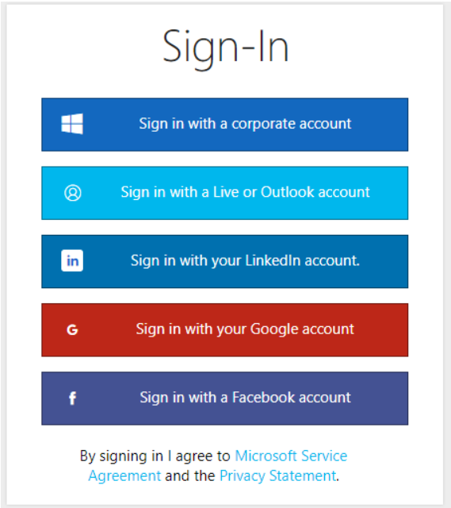

4.  **Welcome!** You now have access to the Video Indexer web
    experience. After logging in you will be dropped into the Video
    Gallery where you can see all your uploaded videos as well as sample
    videos. From here you can search in all videos, upload new videos,
    see insights for each specific video and more.

    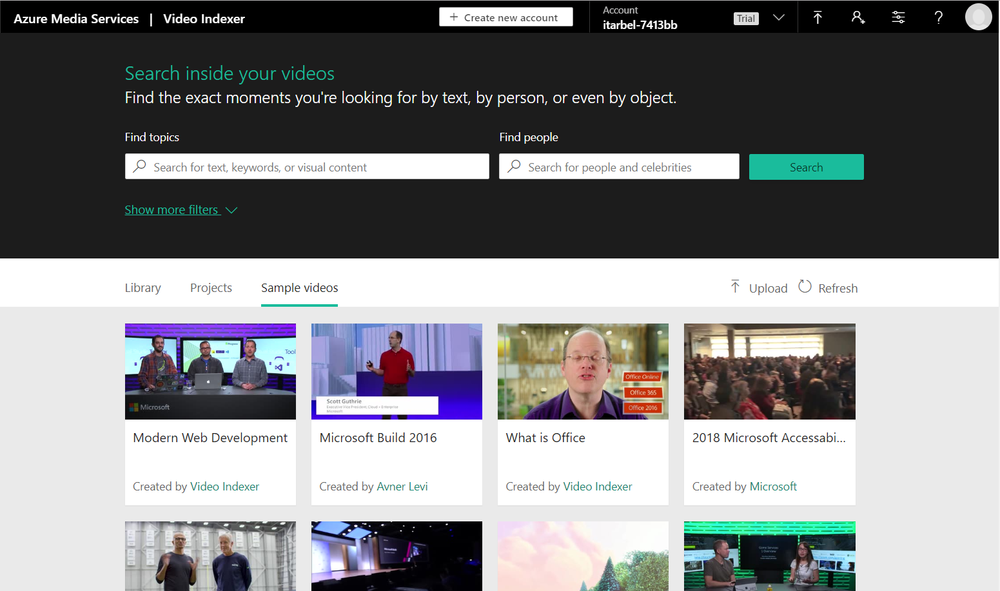

Next. Search within existing files
===============================================

# Exercise 2: Search within existing files

*Duration: 4 minutes*

Context
-------

-   From the Video Indexer portal, you can search for insights on
    indexed video and audio across your catalog. This includes
    identifying celebrities, detecting keywords and labels, finding
    brands and much more. Let's start by searching across sample videos
    that were already indexed for you.

Steps
-----

1.  Click on the "Sample Videos" tab to see all sample videos

    

2.  On the search bar, search for **Build** in the 'Find topics' box and
    for **Satya** in the 'Find people'
    
    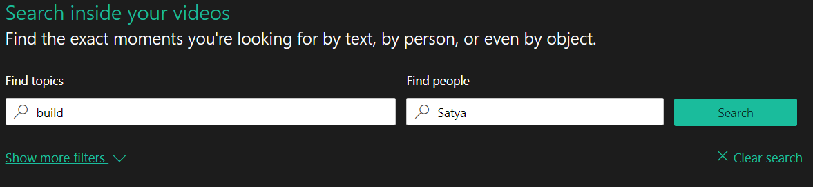

3.  The videos in the gallery will be filtered according to your
    filtering you requested, and each video thumbnail will include a
    summary of the insights found!

    In this case we can see visual, transcript, labels and name insights
    were found. Later in this workshop we will learn more about those
    insights.

    

4.  Click **Show more filters** to see more filtering options such as
    filtering by specific types of insights or specific languages.

5.  Click **Clear search** to start over.

    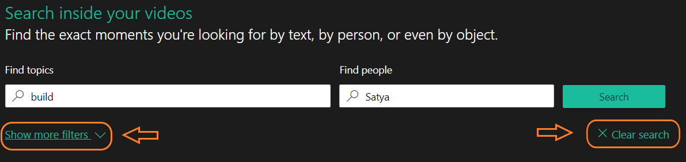

Next. Review insights in a file
============================================

# Exercise 3: Review insights in a file

*Duration: 10 minutes*

Context
-------

-   For each video you can see the cognitive insights found for the
    video and track them as the video runs. This includes a broad set of
    insight types, such as people recognition, celebrity identification,
    keywords extraction, label extraction, brand identification,
    sentiment analysis, keyframe analysis and more.

-   **Important**: These features represent only a subset of the
    insights available via the Video Indexer! We will see several
    options for how to get to more insights later in this workshop
    (hint: you can download the JSON file or use the API to get more
    insights)

Steps
-----

(part of this exercise will require you to play a video, we recommend using
headphones or mute the sound in your laptop to avoid disturbing other
participants)

1.  In the **Sample videos** tab hover over the video called "*Build
    Keynote 2018*".

2.  Click **Play** to go into the video player page

    

3.  In the top of the cognitive insights pane (on the right of the
    screen), click on **Timeline** to see the video transcript. The
    transcript includes the voice to text identified by Video Indexer as
    well as OCRs, people found, sentiment indications and more.

    

4.  Enable the **Autoscroll** toggle on the right to have the transcript
    scroll as the video progresses and the current segment will be highlighted at
    any time

    

    Fun note: you can also see the transcript directly in your layer by
    choosing to **closed captioning** and then **English** in your
    player actions.

    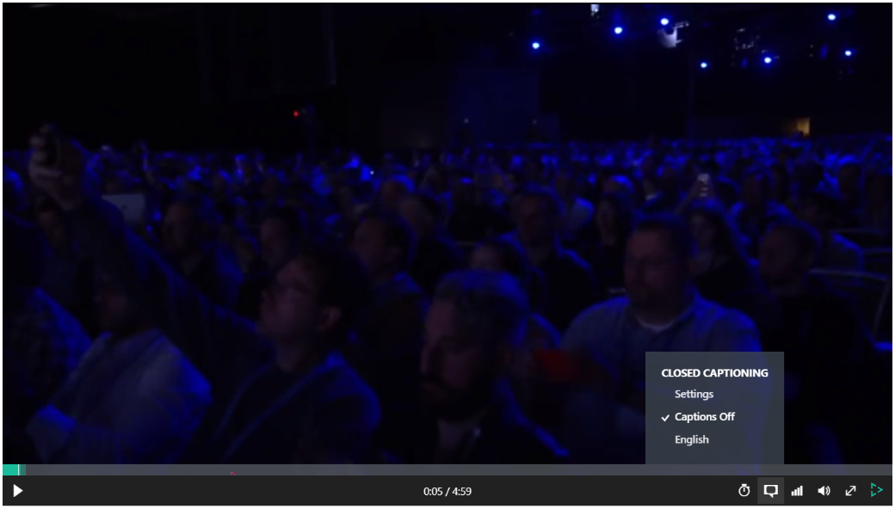

5.  Now, let's explore some of the insights found on this specific
    video. Click on the **Insights** tab to go back to insights summary.

    

1.  **Celebrity Identification**: Video Indexer identified Satya in the
    video, you can see his name, role and biography, as well as how much
    time and when he made appearances in the video. Use the left and
    right arrows to jump between segments he appears in

    

    Video indexer is able identify a large set of celebrities (like
    Satya in this example) out of the box and allows you custom train
    the model with your own celebrities, by tagging additional faces
    identified in your uploaded video.

    *Furthermore, the face model can be trained by images you upload and once you updated the model - the new face recognition model will update all relevant videos already uploaded and all future videos.*

2.  **Topics identification**: Video Indexer uses the information on the transcript, gathered from the spoken information as well as OCR findings in the video, and celebrities it recognized and their bio in Wikipedia to identify relevant topics (i.e. what this video is about?), even if they weren’t mentioned explicitly.
You can read more about this model in our [blog post](https://azure.microsoft.com/en-us/blog/multi-modal-topic-inferencing-from-videos/).

    This can help you get the essence of what was discussed in this
    video. In this case we can see that Satya referred to the
    *Future of technology*, *The future*, *Technology trends*, and more.

    Use the **more topics** or the downward arrow at the top right corner to reveal 
    the full set of topics found and the right and left arrows to navigate to the specific
    location in the video where they appeared.

    

3.  **Label identification**: Labels are visual findings in the video,
    they can help you determine elements, scenes, and locations.

    In this case, the labels: "*man", "standing", "indoor*" really
    reflect on what we see in the video. As in Topics, you can use the
    show all to see the full set of labels found and to use right and
    left arrows to navigate to the specific location in the video where
    they appeared.

    Note: you can see that some of the labels are less relevant, for
    example 'outdoor', this is the nature of machine learning
    algorithms, it is a prediction tool and, in some cases, may be
    erroneous. In this case probably because this movie was shot in a
    huge space. However - looking at the labels still gives you a good
    idea of what this video is about.

    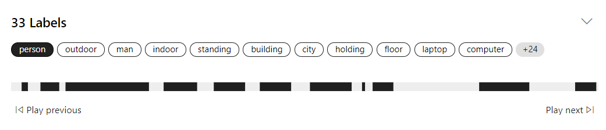

4.  Video Indexer identified six **entities** in this video (three people and three brands),
    that Satya mentioned or appeared as OCR in his keynote. For example, "*Bill Gates*", 
    "*Mark Weiser*" and "*Satya Nadella*". Depends on the content you uploaded, the model can also recognize places and locations. 

    Here as well, use the arrows to jump to the specific
    location in the video where they appeared and to use show
    description to see their Wikipedia abstract.

    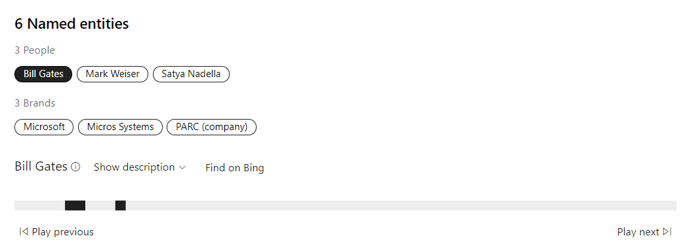

5.  **Emotions**: Video Indexer has also identified the different
    emotions that appear throughout the video. The model can identify four different emotions: anger, fear, joy, and sadness. It does so by using facial expressions, voice tonality, and speech content. It gives a better tuning for the basic sentiment analysis of positive and negative emotions. For further details follow this [link](https://azure.microsoft.com/en-us/blog/cross-channel-emotion-analysis-in-microsoft-video-indexer/).

    Click on each segment to see what actually happened in the video to drive that. you can see
    that overall (unsurprisingly) joy was the main emotions of Satya’s keynote.

    

As part of the default insights presented you can also see the different scenes detected in the video based on visual cues and keyframes extraction.

**Important** - this is only a partial list of the available features of Video Indexer. You can find out more about the different features we offer in our [documentation](https://docs.microsoft.com/en-us/azure/media-services/video-indexer/video-indexer-overview#features).

6.  **Download the insights as a JSON file** by clicking on the **Download** button at the
    bottom left of the video player. You can also download the transcript in different closed caption formats and other file types (SRT, VTT, TTML, TXT and CSV)
    and the artifacts as ZIP.

    

All this information that you can browse on the widgets comes from a
JSON file that it's what the developers would need to work with, if
they're building a custom solution. You will be able to explore the JSON
file in more detail in Exercise 8 below.

Next. Upload and Index your own file
================================================

# Exercise 4: Upload and Index your own file

*Duration: 5 minutes*

Context
-------

-   Video Indexer allows you to upload your own video and audio files

-   Once a file is uploaded and indexed, it is added to your catalog and
    you can search it and review insights on it, like you did in the
    first step

Steps
-----

1.  Go back to the video catalog by clicking the top right corner of the
    screen or by clicking back

    

2.  Click the **Upload** button on the top right of your catalog (under
    the search section)

    

3.  Select the **enter file URL** link and enter the following sample
    URL address: 
    
        https://aka.ms/VISampleVideo

    

4.  Select a 'video name' of your choice for your video and Click
    **Upload**.

    The video will start to upload...

    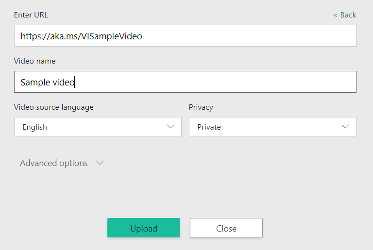

-	**Important:** Using the “*Advanced options*” you can decide if the
indexing would be Audio, Video, or both. You can control the streaming
quality, and more.

5.  The upload may take a few minutes. You can click **Run in the
    background** to continue browsing your existing videos while the
    video is uploading

6.  Once the video is uploaded it will be added to your catalog under the
    **Library** tab and start indexing

    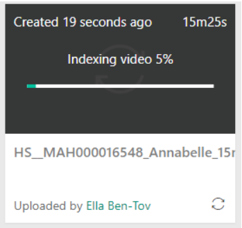

7.  **Done!** You have indexed your first video, you can now explore the
    insights found for this video in the portal as well as on a JSON
    file that a developer could parse on a custom development.

    Try to explore **- what interesting insights you can find in this
    video?**

Next. Embed widgets on your own website
===================================================

# Exercise 5: Embed widgets on your own website

*Duration: 4 minutes*

Context
-------

-   Video Indexer allows you to create an interactive widget for the
    insights gathered on your video as well as for the video player
    itself

Steps
-----

1.  Go back to the "*Build Keynote 2018*", you reviewed in exercise \#3
    (in the **Sample videos** tab)

2.  Click on *Embed* (**\</\>**) at the bottom of the video

    

3.  A 'share & embed' pop up appears, allowing to copy the iframe code
    to the web site. From here you can choose to create an embedded code
    for the cognitive insights, the video player or both.

   

4.  Optional: to test the iframe copy the 'src' part of the 'Copy embed
    code' section into a new tab in your browser (see highlighted part
    in the image above).
    Note: if you copy also the access token, some of the edit function
    will not work once the token is expired (after 1 hour) and you’ll
    need to ask for new one.

Next. Edit a file
=============================

# Exercise 6: Edit a file

*Duration: 5 minutes*

Context
-------

-   Video Indexer also includes a lightweight editor, which makes it is
    easy to find highlights in a video

-   You can filter any insights, select which sections in the
    transcript to edit in and out of the video, and then 
    publish it as a new video

Steps
-----

1.  The video you uploaded in exercise \#4 should be ready by now! Go
    back to the Library tab. Now, to edit the video, you can either:
a.	Press the edit button at the bottom right corner of the video
(it will appear when you’ll put the mouse cursor there).

b.	Or, open the video player and then press *Open in editor*,
beneath the video’s name.
 
    
2.  In the editor you can change the project’s name, add more videos to edit under
    the same project and create a new video that is a combination of them all, choose which insights to see, search, add filters to edit, and more.

    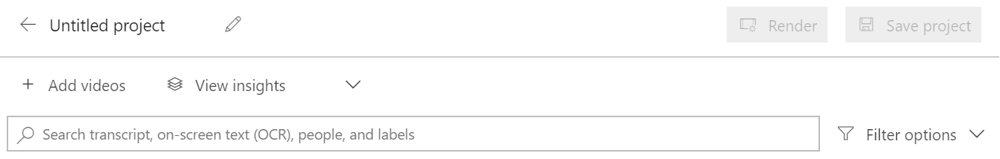

3.  In the filter pane on the left-hand side, you can add filters. For example, 
     add filter for Keywords = ***business transformation*** and People = 
     ***Satya Nadella*** to create a clip of Satya talking about business transformation

    

4.  The transcript will get filtered to show only captions that answer your
    search criteria. Hover on the relevant captions and click the ****
    action on the left side of the transcript to select the clip that
    was filtered

    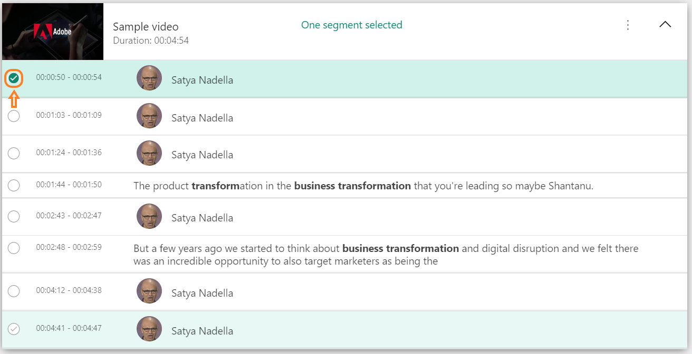

5.  You can look at player, under the **Preview** section on the right, to see your selection
    Result.

    

6.  Click on the **Save project** button to save your selection
    as a new video.

    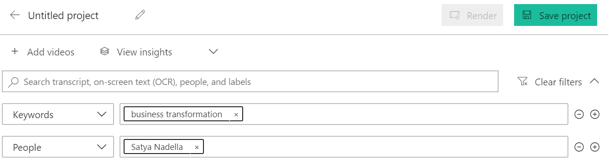

7.  Now, you have a saved project which you can keep on editing. When you are done with editing the project you should render it in order to make it an independent video.

After pressing render, a pop up will appear asking if you want to continue with rendering the project. In few minutes you’ll get an email with a link to the render video which you can download now.

8. A new video that contains a clip from the original video was added
    to your catalog and it’s ready to be played!

**Two important things:** 

A. This whole process could also be done using the API presented in the next section.

B. Until you render the project, the project is dependent on the original videos from which it was samples. Therefore, if you delete an original video before rendering the project it will distort you project.

Next. Getting started with Video Indexer REST API
=============================================================

# Exercise 7: Getting started with Video Indexer REST API

*Duration: 7 minutes*

Context
-------

-   Everything you seen (**and more!**) is available also via the Video
    Indexer REST API

-   Getting started and evaluating the REST API is simple and straight
    forward and **does not require any coding skill!**

-   The Video Indexer rest API is unique in the industry by the fact
    that it enables you to use it in a client to server architecture (as
    well as server to server)

Steps
-----

1.  Open a new tab on your browser

2.  Go to the API portal:

        https://api-portal.videoindexer.ai/
    This portal gives you quick and easy access to review and try out
    the Video Indexer APIs available.

3.  You are probably already logged in via SSO but if not, login with
    the same credentials you logged into the service in exercise \#1

    

4.  Select the **APIs** tab

    

5.  Choose **Authorization** to get the token to call the API operations
    with. Note that this token is valid for one hour, and you’ll need to ask
    for a new one when it expires.

    

6.  Select the **GetAccounts** API call on the left side of the screen

    

7.  click **Try It. **

    Clicking 'try it' on any API call in this web site, will allow you
    to try the API call with your own parameters without needing to
    write any code. In this case, we are trying to get the account
    information in order to call other operations.

    

8.  Fill in the parameters: *location = **trial***,
    *generateAccessTokens=**true***, *allowEdit=**true ***to get access
    token to the account you used in this workshop

    

9.  Scroll to the bottom of the page and click **Send**

    

10. In the result you will get your **account id** and **access token**.

    **\*\*\*Important\*\*\***: **Copy the account id and access token to
    a notepad file or keep the result page open as you will need them
    for later API calls in exercise \#8.**

    

Next. Invoke a sample service
=========================================

# Exercise 8: Invoke a sample service

*Duration: 7 minutes*

Context
-------

-   Now that you are authorized to the API and have your access token
    available, you can try out some of the functions...

Steps
-----

1.  Go to the **APIS** tab again and choose **Operations** to review all
    the REST API calls available to you in video indexer.

    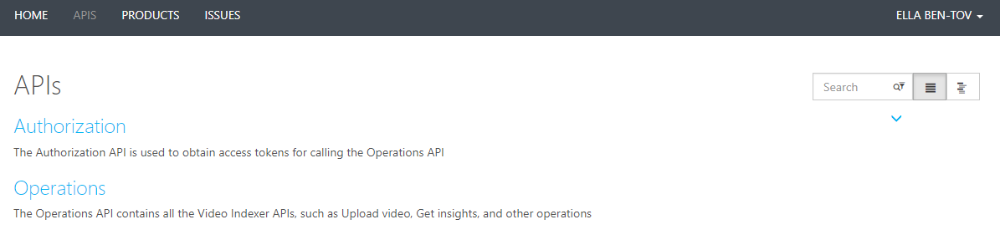

    For this workshop, we will use the API to get insights on the same
    video we uploaded in previous exercise

2.  Choose the **ListVideos** API call in the left side of the screen
    (tip: you can use the search bar on the top to find it)

    

3.  click **Try it** and fill in the parameters: *location = **trial**
    and **account id** and **account token** from the GetAccounts call
    from the previous exercise

    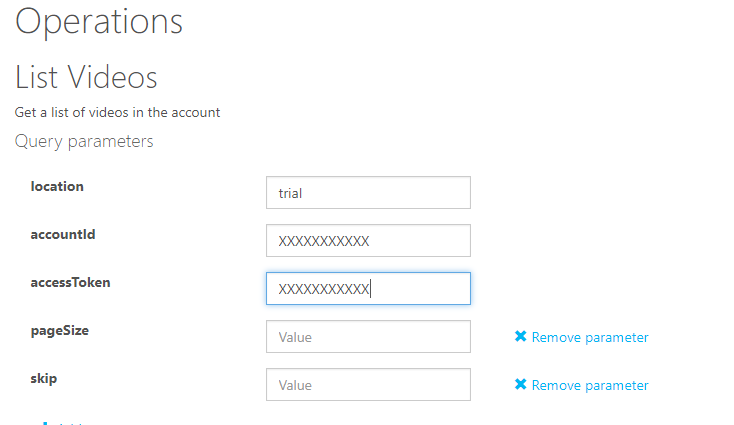

4.  Scroll to the bottom of the page and click **Send**

5.  Your account first result will include the video that you uploaded
    in exercise \#4.

    **\*\*\*Important\*\*\*: Copy the video id (called" id" in the
    result) to notepad or keep the result page open as you will need
    them for later API calls in this exercise**

    

6.  Now choose the **GetVideoIndex** call in the left side of the screen

    

7.  click **Try it** and fill in the parameters:

    a.  *location = **trial** and*

    b.  **account id** from the *GetAccounts* call result

    c.  **access token** from the *GetAccounts* call result

    d.  **video Id** from *ListVideos call* result

    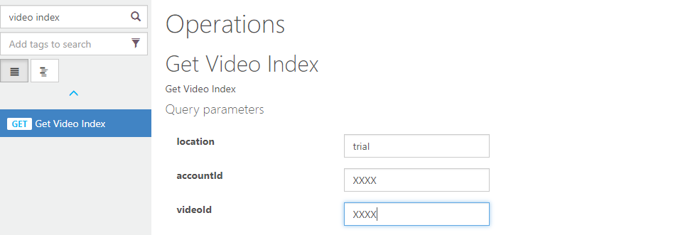

8.  Scroll to the bottom of the page and click **Send**

9.  The result will be in JSON format and includes all the insights
    found on the Video.

    Some insights in this result are not yet available in the Service.
    You can use search for some examples in the response:

    a.  Search for "*moderationState*" and
        "textualContentModeration*" to find content moderation insights
        results. 
        **Content moderations insights** allow you to find and alert on
        inappropriate or offensive content in your videos.

    b.  Search for "*keyFrames*" to find keyFrame results. 
        **Keyframe insights** allow you to identify still images
        representing scenes in videos, to be later used for thumbnails,
        or clips representing the video

# Congratulations!

You successfully completed the Video Indexer workshop!

We hope you have enjoyed this workshop, as you can imagine this is just
the tip of the iceberg, visit **http://video.ai** if you want to
continue learning about Video Indexer and Video AI.
