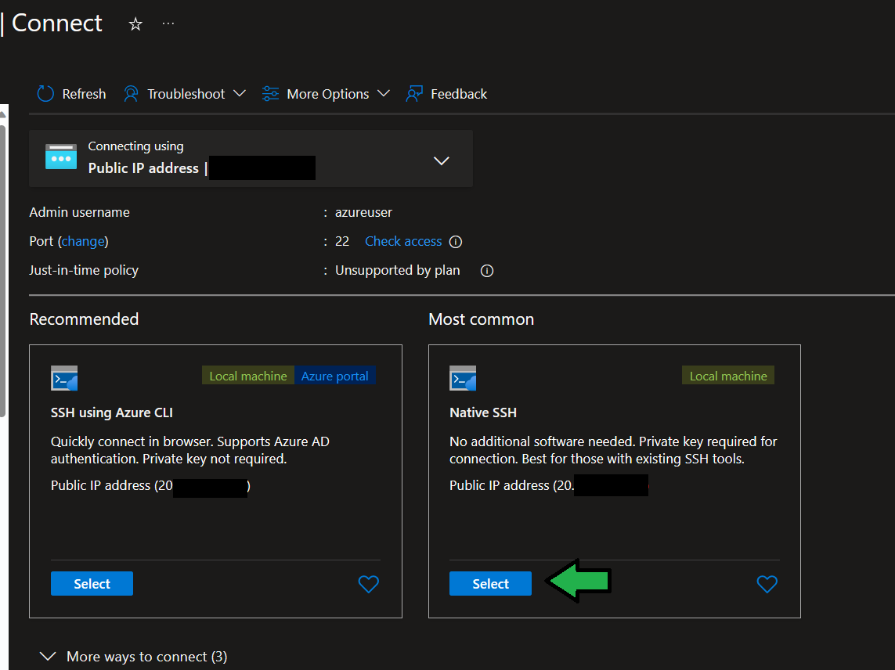
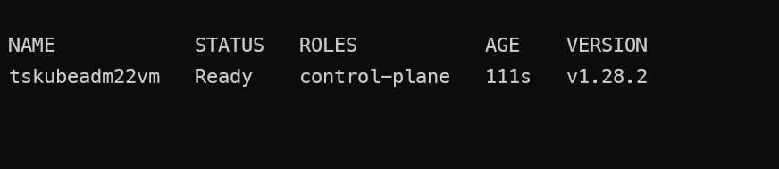
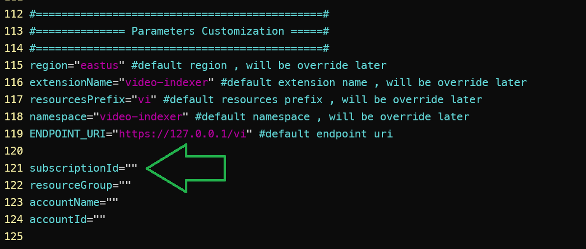

# Deploy Video Indexer Enabled by Arc to Single Node Kubernetes Cluster (Kubeadm)

## About This Tutorial

This document provides onboarding steps and prerequisites for Cluster Administrators, IT Operators, DevOps, and Engineering teams. It enables Video Indexer as an Arc extension on their current local compute layer, which is not based on Azure Kubernetes Clusters.

In this tutorial, you will deploy Video Indexer Enabled by Arc into a "Vanilla" Kubernetes cluster based on Kubeadm platform with the following characteristics:

- A single-node "control-plane" VM, running on Linux, with 32 cores and 128GB memory (this is configurable)
- Kubeadm based cluster, with Calico CNI Driver 

- For more information on kubeadm configuration and options, visit [Kubernetes Documentation](https://kubernetes.io/docs/setup/production-environment/tools/kubeadm/).

> **Notes:**
> - In order to run Kubectl commands on the Cluster, you will need to SSH into the VM.
> - Video Indexer Enabled by Arc can be deployed on ANY Kubernetes cluster, whether On-Prem or Cloud-based.

Once the cluster is created, you will need to SSH into the VM. You will then interact with Azure CLI and Kubectl commands to onboard the Azure Video Indexer Enabled by Arc solution.

## Prerequisites
- To successfully deploy the VI Extension, it is mandatory to have your Azure subscription ID approved in advance. Sign up using [this form](https://aka.ms/vi-register).
- An Azure subscription with the necessary permissions to create Azure resources

## Deployment Steps 

1. **Create Kubeadm Single Node Cluster**

Open the `deploy.sh` script and edit the following variables:

- `prefix`: A user prefix string to serve as an identifier for this tutorial resources.
- `controlPlaneNodeVmSize`: The VM Size to be used as the control-plane single node Kubernetes cluster. Consult your IT Admin to select the right VM Size based on your subscription quota allocations for the deployed region.
- `location`: The location where your solution will be deployed.

**Hint:** To get a list of allowed location names under your subscription, consider using the following snippet:

```bash
az account list-locations --query "[].name" -o tsv
```

Login to Azure

```bash
az login --used-device-code
az account set --subscription <Your_Subscription_ID>
```

Deploy the script by running the following commands : 

```bash
chmod +x ./deploy.sh
./deploy.sh
```

2. **SSH into the Kubernetes control Plane node**

using the Azure Portal Connect to the VM created on previous step.
Use the SSH Keys created on previous step to connect to the VM.




after you log into into the vm swith to the root user by running the follwoing command

```bash
sudo -i
```

ensure your cluster is running by typing the following kubectl command

```bash
kubectl get nodes
```

you are supposed to see the single node cluster with the status 'Ready' 



3. open the install_extension.sh file for edit from the following path:

```bash
vim /tmp/install_extension.sh
```

Edit the following parameters starting at line 114



- `subscriptionId`: The name of your subscription
- `resourceGroup`: The Video Indexer account resource group
- `accountName`: The Video Indexer account resource group
- `accountId`: The Video Indexer account resource group

> **Note:** The Arc Enabled Connected Cluster will be deployed under the name of the `resourceGroup` variable.

4. run the video indexer arc enabled extension by running the following command

```bash
az login --used-device-code
az account set --subscription <Your_Subscription_ID>
./install_extension.sh
```

5. wait for the installation script to complete

6. Validate the pods under the namespace are up and running 

```bash
kubectl get pods -n video-indexer
```

