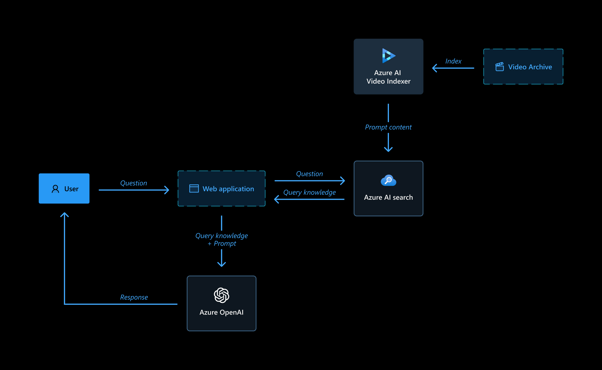
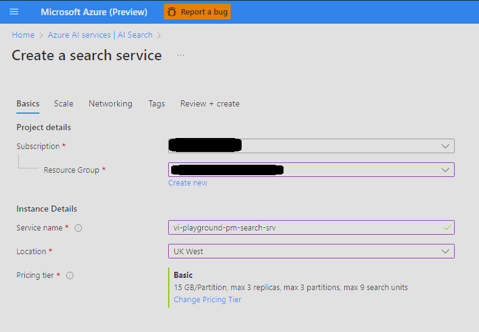

# Video Indexer Archive Q&A using LLM, Vector DB, Azure OpenAI, Azure AI Search, and ChromaDB

This sample is a Video Archive Q&A that uses the Retrieval Augmented Generation (RAG) pattern with your own Azure AI Video Indexer indexed data. It uses Azure OpenAI Service to access the ChatGPT model, and Azure AI Search or ChromaDB for data indexing and retrieval.

The repo includes sample data so it's ready to try end-to-end. The sample we use is an Azure AI Video Indexer introduction video, so you can actually use it to learn more about the product.



## Features

- Q&A interface
- Explores various options to help users evaluate the trustworthiness of responses with citations, tracking of source content, etc.
- Player integration to jump directly to the answer relevant part in the video.

## Getting Started

**IMPORTANT:** To deploy and run this example, you must have an **Azure subscription with access enabled for the Azure OpenAI service**. You can request access [here](https://aka.ms/oaiapply). You can also visit [this page](https://azure.microsoft.com/free/cognitive-search/) to get some free Azure credits to get you started.

**NOTE**: Your Azure Account must have `Microsoft.Authorization/roleAssignments/write` permissions, such as [User Access Administrator](https://learn.microsoft.com/azure/role-based-access-control/built-in-roles#user-access-administrator) or [Owner](https://learn.microsoft.com/azure/role-based-access-control/built-in-roles#owner).

**AZURE RESOURCE COSTS** by default this sample will create an Azure App Service and Azure AI Search resources that have a monthly cost.

## Prerequisites

- [PowerShell > 7.4.2](https://www.microsoft.com/store/productId/9MZ1SNWT0N5D?ocid=pdpshare)
- [Azure Developer CLI](https://aka.ms/azure-dev/install)
- [Python 3.10](https://www.python.org/downloads/)
  - **Important**: Python and the pip package manager must be in the path in Windows for the setup scripts to work.
  - **Important**: Ensure you can run `python --version` from console to check that you have the correct version.
  - **Important**: On Ubuntu, you might need to run `sudo apt install python-is-python3` to link `python` to `python3`.
- [Node.js](https://nodejs.org/en/download/)
- [Git](https://git-scm.com/downloads)
- [Powershell 7+ (pwsh)](https://github.com/powershell/powershell) - For Windows users only.
  - **Important**: Ensure you can run `pwsh.exe` from a PowerShell command. If this fails, you likely need to upgrade PowerShell.
- Install Azure Developer CLI (azd) using the command `winget install Microsoft.Azd` and run the following commands:
  - `azd auth login`
  - `azd env new vi-playground-llm-demo`

## Set up and deployment steps

1. **Create resources**

   Create a resource group to contain all the resources below.

1. **Set up Azure AI Search**

   1. Change pricing tier to Basic.

      

   1. Enter the newly created resource, and note the API key under Settings > Keys, to be used later in the process. You will use the admin key for write permissions to create new indexes.

      

1. **Set up Azure OpenAI**

   1. Create Azure OpenAI instance.
   1. Create model deployments:
      1. text-embedding-ada-002 for embeddings
      1. gpt3.5 turbo or gpt4 turbo or gpt-4o as the LLM model.
   1. Note the deployment names to be used later in the process.
   1. Note API key under Resource management -> Keys and Endpoint to be used later in the process.

1. **Index video archive**

   1. Index videos in VI account.
   1. Make all videos public access.
   1. Define the following azd parameters using `azd env set <Config Key> <Config Value>`:

      - AZURE_OPENAI_API_KEY (Azure OpenAI API key)
      - AZURE_OPENAI_CHATGPT_DEPLOYMENT (Azure OpenAI Chat LLM deployment name}
      - AZURE_OPENAI_EMBEDDINGS_DEPLOYMENT {Azure OpenAI embeddings model deployment name)
      - AZURE_OPENAI_RESOURCE_GROUP (Resource Group name of the Azure OpenAI resource)
      - AZURE_OPENAI_SERVICE (Azure OpenAI resource name)

      - AZURE_SEARCH_KEY (Azure AI Search API key)
      - AZURE_SEARCH_SERVICE (Azure AI Search resource name)
      - AZURE_SEARCH_LOCATION (Azure AI Search instance location, e.g. ukwest)
      - AZURE_SEARCH_SERVICE_RESOURCE_GROUP (Resource Group name of the Azure AI Search resource)
      - AZURE_TENANT_ID (Azure Tenant ID)

      - LANGUAGE_MODEL ("openai")
      - PROMPT_CONTENT_DB (Either: "azure_search" / "chromadb")
      - PROMPT_CONTENT_DB_NAME (Some DB name with this format "vi-db-name-index", this will later appear in the Demo UI under the developer settings so user can select which archive to query)

   1. Index the archive into a new Azure AI Search index (Vector DB) by following these steps:

   1. Install python dependencies with:

      - For Unix/Linux/Mac:

      ```bash
      pip install -r ./app/backend/requirements.txt
      ```

      - For Windows (PowerShell):

      ```powershell
      pip install -r .\app\backend\requirements.txt
      ```

   1. Create a `.env` file that holds your Azure AI Video Indexer details (taken from Azure portal) in the following format:

      ```
      AccountName='YOUR_VI_ACCOUNT_NAME' # This is the name of your Azure AI Video Indexer account.
      ResourceGroup='RESOURCE_GROUP_NAME' # This is the name of the resource group where your Azure AI Video Indexer account is located.
      SubscriptionId='SUBSCRIPTION_ID' # This is the ID of your Azure subscription.
      ```

   1. Save and run the following commands in PowerShell from the workspace root directory:

      - For Unix/Linux/Mac:

      ```bash
      cd ./app/backend/
      export PYTHONPATH=$PYTHONPATH:`pwd` # (to add the current directory to the Python path)
      cd ../../
      python ./app/backend/vi_search/prepare_db.py # (to run the indexing into vector db script)
      ```

      - For Windows (PowerShell):

      ```powershell
      cd .\app\backend\
      $env:PYTHONPATH += ";$(Get-Location)" # (to add the current directory to the Python path)
      cd ..\..\
      python .\app\backend\vi_search\prepare_db.py # (to run the indexing into vector db script)
      ```

      The script will upload the videos in the `data` folder to Azure AI Video Indexer and then index the archive into Azure AI Search or Chroma DB.

   1. Wait for the Vector DB indexing to finish. The process can take some time, as it calls Azure OpenAI to create embeddings of the entire archive, and persists it to Azure AI Search or Chroma DB in batches of 100.
   1. If you are using Chroma DB, which is now configured to save the DB locally, make sure it will be available to the deployment as well.

1. **Deploy**
   1. Install and use PowerShell from https://www.microsoft.com/store/productId/9MZ1SNWT0N5D?ocid=pdpshare
   1. Run `azd up` command to setup the app service resources.
   1. Select subscription and location where to create the app service deployment.
   1. Run `azd deploy` command to deploy the app service and any further changes in the python app service code.

## FAQ

**_Question_**: Why do we need to break up the video `insights.json` into chunks using the Prompt Content API?

**_Answer_**: The sections retrieved from the Video Indexer Prompt Content API allow for the creation of granular records in the vector database. Each of these sections corresponds to a small part of the video. Once the section embedding is generated and subsequently retrieved, the user is shown the relevant time segment in the video.

## Troubleshooting

#### Error during deployment

If you see this error while running `azd deploy`:

`read /tmp/azd1992237260/backend_env/lib64: is a directory`

delete the `./app/backend/backend_env folder` and re-run the `azd deploy` command.

This issue is being tracked here: https://github.com/Azure/azure-dev/issues/1237

If the web app fails to deploy and you receive a '404 Not Found' message in your browser, run 'azd deploy'.

#### Video Indexing Process Timed Out

If the video indexing process timeout is reached, don't worry. You can simply execute the `prepare_db.py` script again. The script is designed to continue where it left off, so you won't lose any progress made before the timeout occurred.

#### Executing prepare_db.py results in a type error

Make sure you have the correct version of Python installed. The script requires Python 3.10. You can check your Python version by running `python --version` in your terminal.
