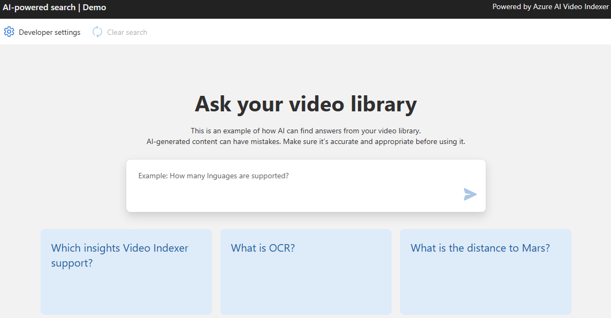

# Video Indexer Archive QnA - LLM + Vector DB - OpenAI + Azure AI Search / ChromaDB


This sample demonstrates Video Archive QnA over your own data indexed on Video Indexer using the Retrieval Augmented Generation (RAG) pattern. It uses Azure OpenAI Service to access the ChatGPT model, and Azure AI Search or ChromaDB for data indexing and retrieval.

The repo includes sample data so it's ready to try end to end. The sample we use Video Indexer intro video, so you can actually use it to learn more about us.


## Features

* Q&A interface
* Explores various options to help users evaluate the trustworthiness of responses with citations, tracking of source content, etc.
* Player integration to jump directly to the answer relevant part in the video.



## Getting Started

> **IMPORTANT:** In order to deploy and run this example, you'll need an **Azure subscription with access enabled for the Azure OpenAI service**. You can request access [here](https://aka.ms/oaiapply). You can also visit [here](https://azure.microsoft.com/free/cognitive-search/) to get some free Azure credits to get you started.

> **AZURE RESOURCE COSTS** by default this sample will create Azure App Service and Azure AI Search resources that have a monthly cost.

### Prerequisites

#### To Run Locally
- [PowerShell > 7.4.2](https://www.microsoft.com/store/productId/9MZ1SNWT0N5D?ocid=pdpshare)
- [Azure Developer CLI](https://aka.ms/azure-dev/install)
- [Python 3+](https://www.python.org/downloads/)
    - **Important**: Python and the pip package manager must be in the path in Windows for the setup scripts to work.
    - **Important**: Ensure you can run `python --version` from console. On Ubuntu, you might need to run `sudo apt install python-is-python3` to link `python` to `python3`.
- [Node.js](https://nodejs.org/en/download/)
- [Git](https://git-scm.com/downloads)
- [Powershell 7+ (pwsh)](https://github.com/powershell/powershell) - For Windows users only.
   - **Important**: Ensure you can run `pwsh.exe` from a PowerShell command. If this fails, you likely need to upgrade PowerShell.

>NOTE: Your Azure Account must have `Microsoft.Authorization/roleAssignments/write` permissions, such as [User Access Administrator](https://learn.microsoft.com/azure/role-based-access-control/built-in-roles#user-access-administrator) or [Owner](https://learn.microsoft.com/azure/role-based-access-control/built-in-roles#owner).


### Installation Guide

## Prerequisites

- Python 3.10 or higher
- Install Azure Developer CLI (azd) using the command `winget install Microsoft.Azd` and run the following commands:
  - `azd auth login`
  - `azd env new vi-playground-llm-demo`

## Steps

1. **Create resources**

   - Create a Resource group for all the resources below.

2. **Set up Azure AI Search**
   - Change pricing tier to Basic.
   

   - Enter the newly created resource, and note the API key under Settings > Keys, to be used later in the process.
   

   - We need an admin key because we need write permissions to create new indexes.

3. **Set up Azure OpenAI**

   - Create Azure OpenAI instance.
   - Create model deployments of text-embedding-ada-002 for embeddings, and gpt3.5 turbo / gpt4 turbo / gpt-4o as LLM model, note the deployment names to be used later in the process.
   - Note API key under Resource management -> Keys and Endpoint to be used later in the process.

4. **Index video archive**

   - Index videos in VI account.
   - Make all videos public access.
   - Define the following azd params using `azd env set <Config Key> <Config Value>`:
     - AZURE_OPENAI_API_KEY (Azure OpenAI API key)
     - AZURE_OPENAI_CHATGPT_DEPLOYMENT (Azure OpenAI Chat LLM deployment name)
     - AZURE_OPENAI_EMBEDDINGS_DEPLOYMENT (Azure OpenAI embeddings model deployment name)
     - AZURE_OPENAI_RESOURCE_GROUP (Resource Group name of the Azure OpenAI resource)
     - AZURE_OPENAI_SERVICE (Azure OpenAI resource name)

     - AZURE_SEARCH_KEY (Azure AI Search API key)
     - AZURE_SEARCH_SERVICE (Azure AI Search resource name)
     - AZURE_SEARCH_LOCATION (Azure AI Search instance location, e.g. ukwest)
     - AZURE_SEARCH_SERVICE_RESOURCE_GROUP (Resource Group name of the Azure AI Search resource)
     - AZURE_TENANT_ID (Azure Tenant ID)

     - LANGUAGE_MODEL ("openai")
     - PROMPT_CONTENT_DB (Either: "azure_search" / "chromadb")
     - PROMPT_CONTENT_DB_NAME (Some DB name with this format "vi-db-name-index")

   - Index the archive into a new Azure AI search index (vector DB) by following these steps:
     1. Install python dependencies: `pip install -r .\app\backend\requirements.txt`
     2. Create a `.env` file that holds your VideoIndexer details (Taken from Azure Portal) in the following format:
        ```
        AccountName='YOUR_VI_ACCOUNT_NAME'
        ResourceGroup='RESOURCE_GROUP_NAME'
        SubscriptionId='SUBSCRIPTION_ID'
        ```
     3. Optionally make changes in `.\app\backend\vi_search\prep_db.py`
     4. Save and run the following commands in powershell from the workspace root directory:
        - `$env:PYTHONPATH += ";$(Get-Location)"` (to add the current directory to the python path)
        - `python .\app\backend\vi_search\prep_db.py` (to run the indexing into vector db script)
     5. Wait for the vector DB indexing to finish. The process can take some time, as it calls Azure OpenAI to create embeddings of the entire archive, and persists it to Azure AI Search or Chroma DB in batches of 100.
     6. If you are using ChromaDB, which is now configured to save the DB locally, make sure it will be available to the deployment as well.

5. **Deploy**
   - Install and use PowerShell from https://www.microsoft.com/store/productId/9MZ1SNWT0N5D?ocid=pdpshare
   - Run `azd up` command to setup the app service resources.
   - Select subscription and location where to create the app service deployment.
   - Run `azd deploy` command to deploy the app service and any further changes in the python app service code.


### FAQ

***Question***: Why do we need to break up the video `insights.json` into chunks using the Prompt Content API?

***Answer***: The sections retrieved from the Video Indexer Prompt Content API allow for the creation of granular records in the vector database. Each of these sections corresponds to a small part of the video. Once the section embedding is generated and subsequently retrieved, we can direct the user to the relevant time segment in the resulting video.

### Troubleshooting

If you see this error while running `azd deploy`: `read /tmp/azd1992237260/backend_env/lib64: is a directory`, then delete the `./app/backend/backend_env folder` and re-run the `azd deploy` command.  This issue is being tracked here: https://github.com/Azure/azure-dev/issues/1237

If the web app fails to deploy and you receive a '404 Not Found' message in your browser, run 'azd deploy'.

