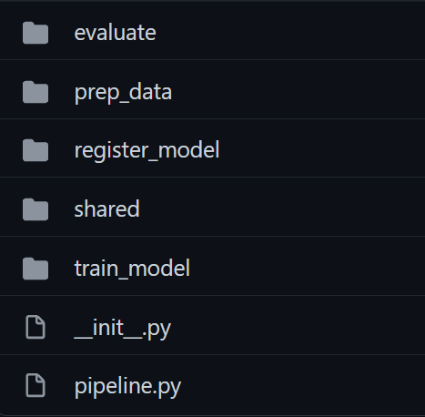
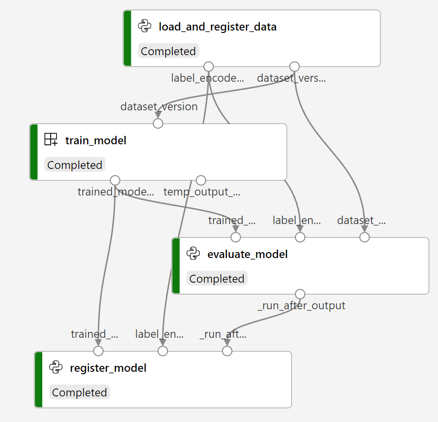

## Video classification based on audio transcripts extracted with Azure Video Analyzer for Media

Authors and contributors: Karol Żak, Chris Hughes, Lena Labzina, Shane Peckham

For video classification tasks it sometimes happens that visual features of videos are not well correlated with ground truth labels which causes the final model to perform poorly. This example shows how to deal with such datasets and build video classification model based on audio transcripts rather than visual features. Note that this methodology can only be applied to videos which actually have speech in the audio track.

Prerequisites:  
- [Azure Subscription](https://azure.microsoft.com/en-us/free)
- [Azure Video Analyzer for Media account](https://docs.microsoft.com/en-us/azure/azure-video-analyzer/video-analyzer-for-media-docs/connect-to-azure#create-a-new-account-on-azure)
- [Azure Machine Learning Workspace](https://docs.microsoft.com/en-us/azure/machine-learning/quickstart-create-resources#create-the-workspace)
  
Solution steps:  
- preprocess videos with AVAM to extract transcripts and other insights
- create a dataset which consists of extracted transcripts + ground truth label column
- train and evaluate DistilBERT model on prepared data using Azure Machine Learning pipeline

Follow [Transcripts classification notebook](notebooks/Transcripts%20classification.ipynb) to reproduce above steps using a dummy dataset.

This example highly depends on AML Pipeline defined under `training` directory which consists mostly of `pipeline.py` which defines, builds and runs the pipeline + some sub directories for each specific step like training and evaluation as well as shared utils directory:

