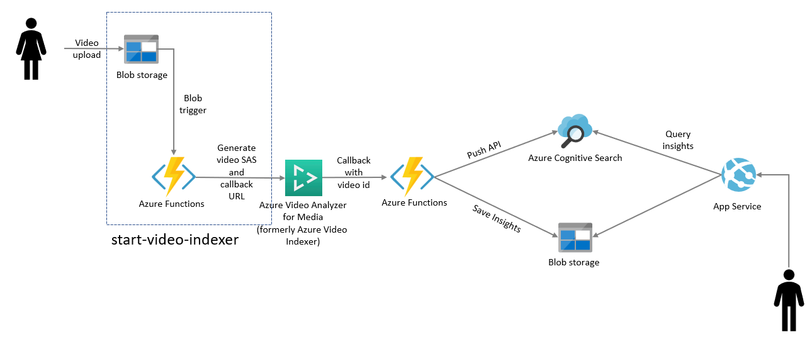

# BlobTrigger - Python

The `BlobTrigger` makes it incredibly easy to react to new Blobs inside of Azure Blob Storage.  
This function process data from a given Blob using Python.

## How it works

For a `BlobTrigger` to work, you provide a path which dictates where the blobs are located inside your container, and can also help restrict the types of blobs you wish to return. For instance, you can set the path to `samples/{name}.mp4` to restrict the trigger to only the samples path and only blobs with ".mp4" at the end of their name.

## Architecture

