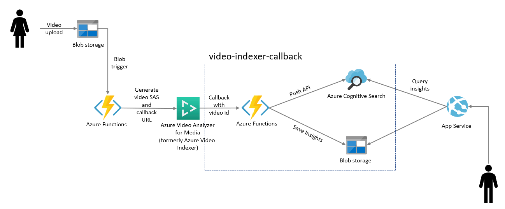

# Video Indexer Callback - Python

Function can be passed as callback endpoint for Azure Video Indexer.  

## How it works

Once the video processing is completed, Azure Video Indexer sends a POST request to the endpoint, passing in Query string some paratemeters about the processed video, such as Id and State.

## Architecture

